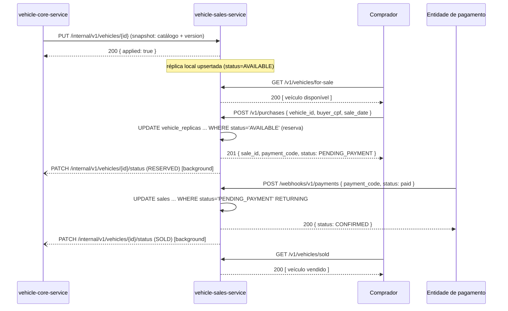

# Vehicle Sales Service

[](https://github.com/pre-commit/pre-commit)
[](https://sonarcloud.io/summary/new_code?id=ketillin-tavares_vehicle-sales-service)
[](https://sonarcloud.io/summary/new_code?id=ketillin-tavares_vehicle-sales-service)

Serviço de venda de veículos: listagem de veículos disponíveis e vendidos (ordenadas por preço),
compras e webhook de pagamento. Possui banco de dados próprio (`vehicle_sales`), isolado do banco
do `vehicle-core-service`, e é a **fonte da verdade do estado comercial** de cada veículo
(disponível, reservado, vendido).

## Sumário

- [Como foi implementado](#como-foi-implementado)
- [Endpoints](#endpoints)
- [Exemplos de uso](#exemplos-de-uso)
- [Estrutura do projeto](#estrutura-do-projeto)
- [Comunicação com o vehicle-core-service](#comunicação-com-o-vehicle-core-service)
- [Fluxo ponta a ponta](#fluxo-ponta-a-ponta)
- [Como rodar localmente](#como-rodar-localmente)
- [Como testar](#como-testar)
- [CI/CD](#cicd)
- [Infraestrutura e deploy](#infraestrutura-e-deploy)

## Como foi implementado

Stack: **Python 3.13**, **FastAPI**, **Pydantic v2** / **pydantic-settings**, **SQLAlchemy 2.0**
(async) + **asyncpg**, **Alembic** para migrações, **PostgreSQL 17**, **loguru** para logging
estruturado e **uv** como único gerenciador de dependências.

A aplicação segue **Clean Architecture** com **Ports & Adapters**, organizada em quatro camadas
com dependências sempre apontando para o centro (domínio):

- **Domain** (`src/domain/`) — entidades `VehicleReplica` (réplica local do catálogo, com o status
  comercial `AVAILABLE` / `RESERVED` / `SOLD`) e `Sale` (ciclo de vida `PENDING_PAYMENT` /
  `CONFIRMED` / `CANCELED`); exceções de domínio (`VehicleNotFoundError`, `VehicleUnavailableError`,
  `SaleNotFoundError`, `InvalidPaymentTransitionError`, `InvalidCpfError`) e os Ports de persistência
  `VehicleReplicaRepository` e `SaleRepository` (`abc.ABC`). Não depende de nenhuma camada externa,
  exceto `pydantic`.
- **Application** (`src/application/`) — casos de uso (`ListVehiclesForSale`, `ListSoldVehicles`,
  `PurchaseVehicle`, `ProcessPaymentWebhook`, `UpsertVehicleReplica`), DTOs de fronteira e o Port de
  infraestrutura `CoreNotifier` (comunicação com o `vehicle-core-service`).
- **Interface** (`src/interface/`) — controllers FastAPI (`v1/listing_controller.py`,
  `v1/purchase_controller.py`, `v1/payment_webhook_controller.py`,
  `v1/internal_vehicle_controller.py`, `health_controller.py`), gateways/adapters concretos
  (`SQLAlchemySaleRepository`, `SQLAlchemyVehicleReplicaRepository`, `HttpCoreNotifier`) e
  presenters (schemas de request e de erro).
- **Infrastructure** (`src/infrastructure/`) — engine/sessão async do SQLAlchemy, models ORM,
  cliente HTTP compartilhado, observabilidade (`loguru`) e migrações Alembic.

As exceções de domínio nunca carregam códigos HTTP; a tradução para respostas HTTP acontece
exclusivamente em `src/main.py`, via `@app.exception_handler`.

### O catálogo é uma réplica local (read model)

O `vehicle-sales-service` **não lê o catálogo do `vehicle-core-service` em tempo real**. Ele mantém
uma cópia local (`VehicleReplica`) alimentada por snapshots que o Core envia via
`PUT /internal/v1/vehicles/{vehicle_id}` sempre que um veículo é cadastrado ou editado. Essa decisão
preserva o isolamento de bancos exigido pelo desafio — cada serviço só escreve no próprio banco — sem
tornar a listagem de venda dependente de uma chamada síncrona ao Core a cada requisição:
`/v1/vehicles/for-sale` e `/v1/vehicles/sold` são resolvidas inteiramente contra o banco
`vehicle_sales`.

### Guarda de versão otimista

O envio do snapshot é best-effort e sujeito a reordenação de rede (retries do Core, múltiplas
instâncias). Por isso o upsert usa uma escrita condicional de PostgreSQL, ao invés de um SELECT
seguido de UPDATE:

```sql
INSERT INTO vehicle_replicas (vehicle_id, brand, model, year, color, price, status, version, ...)
VALUES (:vehicle_id, :brand, :model, :year, :color, :price, :status, :version, ...)
ON CONFLICT (vehicle_id) DO UPDATE
SET brand = excluded.brand, model = excluded.model, year = excluded.year,
    color = excluded.color, price = excluded.price, version = excluded.version, ...
WHERE vehicle_replicas.version < excluded.version;
```

Se o snapshot recebido tiver uma versão menor ou igual à já armazenada, o `UPDATE` não afeta nenhuma
linha: `upsert_snapshot` retorna `applied=False`, exposto na resposta de
`PUT /internal/v1/vehicles/{vehicle_id}`, e o snapshot obsoleto é descartado — sem lock e sem
coordenação distribuída entre os dois serviços.

### Por que existe o status `RESERVED`

O enunciado do desafio descreve apenas "disponível" e "vendido", mas um veículo comprado passa por
um intervalo em que já não deveria aparecer em `/for-sale`, mas também ainda não é uma venda
confirmada (o pagamento pode ser cancelado). Sem um terceiro estado, ou o veículo continuaria
aparecendo como disponível durante a janela de pagamento — permitindo venda duplicada — ou seria
removido da listagem antes de haver certeza da venda. `RESERVED` resolve isso:
`list_available_by_price()` só retorna veículos com status `AVAILABLE`, e a reserva e a liberação são
movimentos explícitos de estado, nunca inferidos a partir de outra tabela.

### Vendas é dona do estado comercial

O `UPDATE` do `ON CONFLICT` do upsert de catálogo **nunca inclui a coluna `status`** — ela só recebe
o valor `AVAILABLE` na inserção inicial da réplica. Isso significa que o Core não pode sobrescrever o
estado comercial de um veículo mesmo reenviando o snapshot inteiro (ex.: numa edição de preço): o
status é escrito exclusivamente pelo próprio `vehicle-sales-service`, através de `reserve()` e
`set_status()`.

### Transições atômicas

- **Reserva** (`PurchaseVehicle`) — um único `UPDATE` condicional:
  `UPDATE vehicle_replicas SET status='RESERVED' WHERE vehicle_id=:id AND status='AVAILABLE'`. A
  concorrência é decidida pelo `rowcount` retornado pelo próprio banco: se duas compras chegam ao
  mesmo tempo, apenas uma altera uma linha; a outra recebe `rowcount=0` e o caso de uso lança
  `VehicleUnavailableError` (HTTP 409). Não há leitura seguida de escrita nem lock explícito.
- **Webhook de pagamento** (`ProcessPaymentWebhook`) — a mesma técnica aplicada à venda:
  `UPDATE sales SET status=:novo WHERE payment_code=:code AND status='PENDING_PAYMENT' RETURNING *`,
  com três desfechos possíveis:
  1. Nenhuma venda com esse `payment_code` → `SaleNotFoundError` (HTTP 404).
  2. A venda já está no status de destino (notificação repetida) → resposta HTTP 200 idempotente,
     sem nova escrita.
  3. A venda existe mas está em outro status final divergente (ex.: cancelar uma venda já
     confirmada) → `InvalidPaymentTransitionError` (HTTP 409).

  Quando a transição é aplicada, o status do veículo na réplica é atualizado na mesma transação
  (`SOLD` ou de volta a `AVAILABLE`), e o Core é notificado como *background task* após o commit.

## Endpoints

| Método | Rota | Auth | Descrição |
|---|---|---|---|
| `GET` | `/v1/vehicles/for-sale` | — | Lista os veículos disponíveis, ordenados por preço crescente |
| `GET` | `/v1/vehicles/sold` | — | Lista os veículos vendidos, ordenados por preço de venda crescente |
| `POST` | `/v1/purchases` | — | Reserva um veículo e cria a venda aguardando pagamento (`201`) |
| `POST` | `/webhooks/v1/payments` | `X-Webhook-Token` | Processa a notificação de pagamento de forma idempotente |
| `PUT` | `/internal/v1/vehicles/{vehicle_id}` | `X-Internal-Token` | Aplica o snapshot de catálogo publicado pelo Core (rota interna, chamada pelo `vehicle-core-service`) |
| `GET` | `/health` | — | Health check |

Documentação interativa completa (schemas de request/response e códigos de erro) em `/docs`
(Swagger) e `/redoc` com o serviço no ar. As rotas internas (`/internal/v1/...`) ficam **fora** do
schema público do OpenAPI (`include_in_schema=False`) — continuam funcionando normalmente, apenas
não são divulgadas na documentação, já que só o `vehicle-core-service` as consome.

## Exemplos de uso

Exemplos contra a stack local (`http://localhost:8001`, ver [Como rodar
localmente](#como-rodar-localmente)).

### Criar uma compra

```bash
curl -X POST http://localhost:8001/v1/purchases \
  -H "Content-Type: application/json" \
  -d '{
    "vehicle_id": "3fa85f64-5717-4562-b3fc-2c963f66afa6",
    "buyer_cpf": "52998224725",
    "sale_date": "2026-08-08"
  }'
```

Resposta `201 Created`:

```json
{
  "sale_id": "9c3b6e2a-8f1d-4b7a-9e2b-1a2c3d4e5f60",
  "vehicle_id": "3fa85f64-5717-4562-b3fc-2c963f66afa6",
  "sale_price": "95000.00",
  "payment_code": "kQ2fZ8JvOpaqueTokenDeExemplo",
  "status": "PENDING_PAYMENT"
}
```

### Webhook — pagamento confirmado

```bash
curl -X POST http://localhost:8001/webhooks/v1/payments \
  -H "Content-Type: application/json" \
  -H "X-Webhook-Token: $PAYMENT_WEBHOOK_TOKEN" \
  -d '{
    "payment_code": "kQ2fZ8JvOpaqueTokenDeExemplo",
    "status": "paid"
  }'
```

Resposta `200 OK`:

```json
{
  "payment_code": "kQ2fZ8JvOpaqueTokenDeExemplo",
  "vehicle_id": "3fa85f64-5717-4562-b3fc-2c963f66afa6",
  "status": "CONFIRMED"
}
```

### Webhook — pagamento cancelado

```bash
curl -X POST http://localhost:8001/webhooks/v1/payments \
  -H "Content-Type: application/json" \
  -H "X-Webhook-Token: $PAYMENT_WEBHOOK_TOKEN" \
  -d '{
    "payment_code": "kQ2fZ8JvOpaqueTokenDeExemplo",
    "status": "canceled"
  }'
```

Resposta `200 OK`:

```json
{
  "payment_code": "kQ2fZ8JvOpaqueTokenDeExemplo",
  "vehicle_id": "3fa85f64-5717-4562-b3fc-2c963f66afa6",
  "status": "CANCELED"
}
```

### Erro — veículo já reservado/vendido

Tentar comprar um veículo que não está `AVAILABLE` retorna `409`, sem tocar no banco:

```bash
curl -i -X POST http://localhost:8001/v1/purchases \
  -H "Content-Type: application/json" \
  -d '{
    "vehicle_id": "3fa85f64-5717-4562-b3fc-2c963f66afa6",
    "buyer_cpf": "52998224725",
    "sale_date": "2026-08-08"
  }'
```

Resposta `409 Conflict`:

```json
{
  "detail": "Veículo 3fa85f64-5717-4562-b3fc-2c963f66afa6 não está disponível para compra"
}
```

## Estrutura do projeto

```
service/
├── src/
│   ├── main.py                    # App factory FastAPI + lifespan + exception handlers
│   ├── environment.py             # Settings (pydantic-settings), lidas de variáveis de ambiente
│   ├── domain/
│   │   ├── entities/              # VehicleReplica, Sale (status e regras de negócio)
│   │   ├── repositories/          # Ports de persistência (VehicleReplicaRepository, SaleRepository)
│   │   └── exceptions.py          # Exceções de domínio
│   ├── application/
│   │   ├── use_cases/             # ListVehiclesForSale, ListSoldVehicles, PurchaseVehicle,
│   │   │                          # ProcessPaymentWebhook, UpsertVehicleReplica
│   │   ├── ports/core_notifier.py # Port de notificação do vehicle-core-service
│   │   └── dtos/                  # DTOs de fronteira (listagem, venda, webhook, snapshot)
│   ├── interface/
│   │   ├── controllers/           # Rotas FastAPI (v1 público, webhook, internal, health)
│   │   ├── gateways/               # Adapters: SQLAlchemy*Repository, HttpCoreNotifier
│   │   └── presenters/             # Schemas de request e de erro
│   └── infrastructure/
│       ├── database/               # Engine async + session factory
│       ├── models/                 # Models ORM (SQLAlchemy)
│       ├── http/                   # Cliente httpx compartilhado (lifespan)
│       ├── observability/          # Configuração do loguru
│       └── alembic/                # Migrações do banco
├── tests/                          # Espelha src/ (unit) + tests/integration/ (testcontainers)
├── scripts/seed.py                 # Popula a réplica de catálogo com dados fixos de demonstração
├── Dockerfile                      # Multistage build
├── docker-compose.yml              # Stack local (postgres + migrations + seed + app)
├── Makefile                        # format / lint / typecheck / test-cov / quality
├── alembic.ini
└── env.example
```

## Comunicação com o vehicle-core-service

Os dois serviços têm bancos de dados isolados e trocam apenas snapshots via HTTP:

- **Core → Sales (snapshot de catálogo):** ao cadastrar ou editar um veículo, o Core envia
  `PUT /internal/v1/vehicles/{vehicle_id}` com os dados de catálogo e a `version`, autenticado pelo
  header `X-Internal-Token`. O caso de uso `UpsertVehicleReplica` aplica o snapshot na réplica local,
  respeitando a guarda de versão descrita em [Como foi implementado](#como-foi-implementado).
- **Sales → Core (mirror de status):** quando o Sales reserva um veículo (`POST /v1/purchases`) ou
  conclui/cancela uma venda (`POST /webhooks/v1/payments`), ele notifica o Core em
  `PATCH /internal/v1/vehicles/{vehicle_id}/status`, autenticado pelo mesmo `X-Internal-Token`, via
  `CoreNotifier` (`HttpCoreNotifier`), como *background task* agendada após o commit da transação —
  com até 3 tentativas e backoff. Falhas de rede são logadas e absorvidas: a disponibilidade das
  vendas não depende do Core estar no ar.

### Webhook de pagamento

O webhook de notificação de pagamento (`POST /webhooks/v1/payments`) é hospedado neste serviço por
decisão deliberada de arquitetura, não por omissão do enunciado: o ciclo de vida da venda e a
transição atômica venda/veículo pertencem ao banco segregado do `vehicle-sales-service`. Veja a
justificativa completa em
[`docs/adr/0001-webhook-pagamento-no-servico-de-vendas.md`](./docs/adr/0001-webhook-pagamento-no-servico-de-vendas.md).

## Fluxo ponta a ponta



## Como rodar localmente

### Pré-requisitos

- [Docker](https://docs.docker.com/get-docker/) e Docker Compose
- [uv](https://docs.astral.sh/uv/) (para rodar fora de container) + Python 3.13

### Stack local

| Componente | Porta host | Porta container |
|---|---|---|
| API | 8001 | 8000 |
| PostgreSQL | 5433 | 5432 |
| Floci (emulador AWS) | 4567 | 4566 |

### Com Docker Compose (recomendado)

```bash
cd service
cp env.example .env
docker compose up --build
```

Isso sobe `postgres`, roda as migrações (`alembic upgrade head`) e inicia a API. Health check em
<http://localhost:8001/health>.

### Bare metal (sem Docker)

```bash
cd service
cp env.example .env
uv sync
# suba um PostgreSQL compatível com as variáveis DATABASE_* do .env
uv run alembic upgrade head
uv run uvicorn src.main:app --reload --port 8000
```

### Documentação interativa da API

Com o serviço no ar: `http://localhost:8001/docs` (Swagger) ou `http://localhost:8001/redoc`.

## Como testar

```bash
cd service
uv sync

# suíte de qualidade completa (equivalente ao Makefile)
make quality            # ruff format + ruff check --fix + ty check + pytest --cov

# comandos individuais
uv run ruff format src/ tests/
uv run ruff check --fix src/ tests/
uv run ty check src/
uv run pytest --cov=src --cov-report=term-missing -m "not integration"

# testes de integração (sobem um PostgreSQL efêmero via testcontainers)
uv run pytest -m integration
```

Estado atual da suíte: **115 testes unitários + 5 testes de integração**, com **99% de cobertura**
de `src/` — acima do mínimo exigido pela CI (`--cov-fail-under=80`). Os testes de integração usam
[testcontainers](https://testcontainers.com/) para subir um PostgreSQL descartável — nunca o banco
do `docker-compose.yml` local.

## CI/CD

Definido em `.github/workflows/`:

- **`ci.yml`** — roda em todo Pull Request: `ruff format --check`, `ruff check`, `ty check`,
  `pytest` (unitários com cobertura ≥ 80% + integração via testcontainers), build de imagem Docker
  (smoke test) e, se configurado, análise no SonarCloud.
- **`cd.yml`** — roda a cada push em `main`: repete o quality gate, publica a imagem no Amazon ECR
  e faz o deploy na instância EC2 via AWS Systems Manager (SSM Run Command).
- **`infra.yml`** — execução manual (`workflow_dispatch`) de `terraform apply`/`destroy` da infra
  em produção, protegida pelo ambiente `infra` do GitHub (aprovação obrigatória).

## Infraestrutura e deploy

Detalhes de infraestrutura provisionada, variáveis de ambiente/segredos e deploy em produção estão
documentados separadamente para não duplicar conteúdo:

- [`infra/README.md`](./infra/README.md) — infraestrutura AWS (Terraform Cloud), variáveis de
  ambiente/segredos completas e o fluxo de deploy. Cobre também o provider OIDC do GitHub
  compartilhado com o `vehicle-core-service` e a ordem de apply entre os dois serviços.
- [`infra/local/README.md`](./infra/local/README.md) — como validar a infraestrutura localmente
  com o emulador [Floci](https://hub.docker.com/r/floci/floci).
